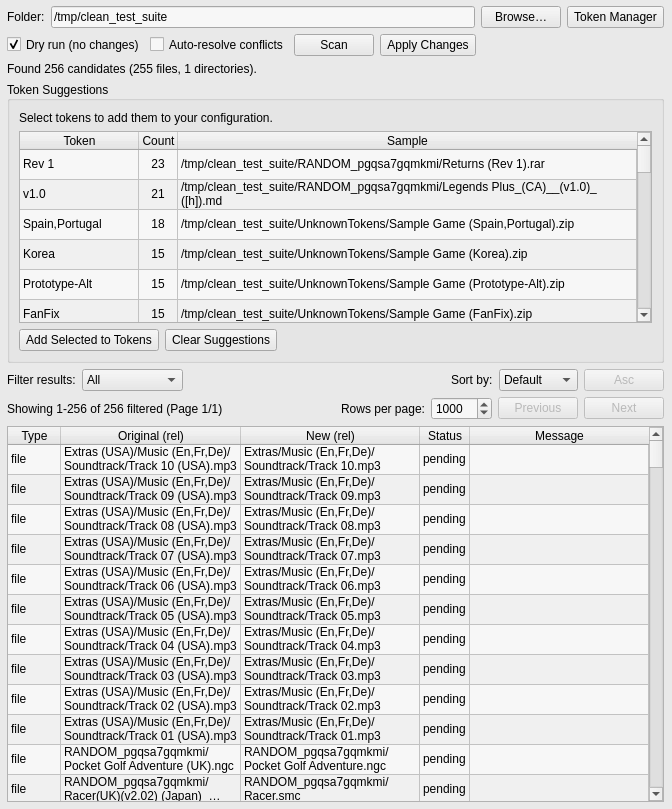

# Clean Filenames (Python Edition)

Python reimplementation of my `cleanfilenames.ps1` utility with both CLI and GUI front-ends. It removes region tags like `(USA)`, `(JP)`, `(En,Fr,De,Es)` from file/folder names and tidies whitespace.



## Layout

```
cleanfilenames-gui/
├── cleanfilenames_core.py              # Core rename logic + CLI
├── cleanfilenames_gui.py               # PySide6 GUI
├── config_manager.py                   # Configuration management + presets
├── token_manager.py                    # Token validation + suggestions
├── generate_cleanfilenames_testdata.py # Test data generator
├── presets/                            # Default + minimal token lists
└── README.md
```

## Requirements

- Python 3.9+ (system Python is 3.13.7)
- PySide6 for the GUI

Install dependencies (recommend a venv):

```bash
cd /hoard/workspace/cleanfilenames-gui
python3 -m venv .venv
source .venv/bin/activate
pip install --upgrade pip
pip install -r requirements.txt
```

## Configuration

Settings are stored in `~/.config/cleanfilenames/config.json` on Linux or `%USERPROFILE%\.config\cleanfilenames\config.json` on Windows (auto-created the first time you run the tool). Example:

```json
{
  "regex": "\\s*\\((?:USA|EU|...)\\)\\s*",
  "tokens": [
    "USA",
    "Europe",
    "JP",
    "PAL"
  ],
  "rename_directories": true,
  "rename_root": true,
  "stop_on_error": false
}
```

- `regex`: pattern used to strip region tags.
- `tokens`: optional list of region keywords (used to rebuild the regex).
- `rename_directories`: toggle directory renaming.
- `rename_root`: allow renaming the selected root folder.
- `stop_on_error`: halt processing on the first failure.

### Working with Tokens & Patterns

- **Tokens** represent the literal text that appears in parentheses in your filenames (e.g., `USA`, `Europe`, `En,Fr,De,Es,It`). Each token can include commas or other characters; the tool treats it as raw text unless you add regex syntax yourself.
- The **pattern** is automatically rebuilt from the token list. The tool adds the wrapping `\s*\((?: ... )\)\s*`, which matches any of the listed tokens with surrounding parentheses/spaces.
- Use the **Token Manager** dialog to edit tokens (one per line), import/export token lists, or load the default/minimal presets.
- Custom regex tweaks are still possible by editing `~/.config/cleanfilenames/config.json`, but the GUI always regenerates the regex from the current tokens to keep everything in sync.

The CLI can load alternate configs with `--config path/to/config.json`.

## CLI Usage

Preview changes:

```bash
python3 cleanfilenames_core.py "/path/to/roms"
```

Apply renames:

```bash
python3 cleanfilenames_core.py "/path/to/roms" --apply
```

The CLI reports collisions (target already exists) and leaves those files untouched.

## GUI Usage

```bash
python3 cleanfilenames_gui.py
```

Features:
- Browse for a folder, scan, and apply changes from a single window.
- Dry run checkbox to simulate renames (status column shows "done (dry run)").
- Auto-resolve checkbox that mirrors the CLI’s `auto_resolve_conflicts` flag.
- Token Manager dialog with preset loader, import/export, duplicate finder, and regex help.
- Token suggestions table that surfaces new tags discovered during scans (append them with one click).
- Built-in manual conflict resolver so you can (right click) edit colliding targets directly in the UI.
- Table results support `Ctrl+C`/`Cmd+C` to copy selected rows as tab-separated text.
- Right-click the results to export CSV; the table includes a "Directory" column so you can see the path relative to the scan root (e.g., `Extras/Music/Track 01`). This mirrors the on-disk rename order.
- For large scans, pagination keeps the UI responsive; export to CSV for full results.

## Testing

A test data generator is included to create realistic ROM-like test datasets:

```bash
# Small dataset (~500 files)
python3 generate_cleanfilenames_testdata.py --small

# Medium dataset (~1500 files)
python3 generate_cleanfilenames_testdata.py --medium

# Large dataset (~10k files)
python3 generate_cleanfilenames_testdata.py --large
```

The generator creates:
- Realisticish ROM filenames with various region tags
- Nested directory structures (Console/Category)
- Directory names with region tags
- Exact collision scenarios (files that would conflict after cleaning)
- Case-insensitive collision scenarios (for Windows testing)
- Test data location: `/tmp/clean_test_suite` on Linux and the root application directory on Windows

After generating, test with:
```bash
python3 cleanfilenames_core.py /tmp/clean_test_suite
python3 cleanfilenames_core.py /tmp/clean_test_suite --apply
```

## Building a Windows `.exe`

1. Install PyInstaller in your (virtual) environment: `pip install pyinstaller`.
2. Run: `pyinstaller --onefile cleanfilenames_gui.py`
3. The resulting executable lives in `dist/cleanfilenames_gui.exe`. Distribute the `dist` folder (Qt plugins live alongside the exe). Repeat on each OS to get native bundles.

## Notes

- Directories are renamed deepest-first to avoid "path not found" issues.
- Collisions are reported in the results table; if the auto-resolve toggle is enabled, the tool will append ` (1)`, ` (2)`, etc. to keep going, just like the CLI’s conflict resolution path.

## TODO

- [x] **Auto Token Discovery**: When scanning files, detect potential region tokens that aren't in the current config and offer to add them automatically. This would help users discover new patterns without manually editing the token list.

- [x] **Manual Conflict Resolution**: After scanning, if there are filename collisions or conflicts, allow manual renaming directly in the GUI. This would eliminate the need to use a file manager or CLI to resolve conflicts - everything can be managed in one place.
- [x] **Conflict Panel**: Investigate moving the conflict resolver into a dedicated panel so multi-item conflicts can be resolved without giant modal dialogs.
- [x] **Result Sorting & Filtering**: Allow sorting the scan results by type/status/message and filter the table down to only passed/failed entries for easier triage.
- [ ] **Detect conflicts during scan, not when applying changes:** Find conflicting files before applying changes and having them fail. When implemented, also add a WARNING in big red letters when the "Auto-resolve conflicts" checkbox is selected, requiring users to acknowledge they understand it will auto-rewrite their filenames.
- [ ] **Import/Export Local Config & Token List:** Add GUI buttons to import/export the user's local configuration file and token list (stored at `~/.config/cleanfilenames/config.json` on Linux or `%USERPROFILE%\.config\cleanfilenames\config.json` on Windows). This would allow users to easily back up, share, or transfer their custom token configurations between machines.
- [ ] **Size Selection for GenerateTestFiles.exe:** Add interactive size selection prompt that pauses the script and asks the user what size test bed to create (small/medium/large) instead of requiring command-line arguments. This would make the tool more user-friendly for non-technical users.
- [ ] **Sortable Column Headers:** Allow clicking on table column headers to sort results by that column (type, old name, new name, status, message, directory).
- [ ] **Progress Bar for Apply Changes:** Add a progress bar during the apply operation to show real-time progress. This requires refactoring to emit progress signals during the rename loop.
- [ ] **Async Scan / Apply Workers:** Move long-running scans and rename jobs off the Qt UI thread (QThread/QtConcurrent) so the GUI stays responsive on 10k+ file runs.
- [ ] **CLI Structured Output Mode:** Add `--json`/`--csv` options so automations can consume rename previews without scraping stdout.
- [ ] **Per-Scan Config Overrides:** Support saving/loading alternate configs from the GUI (or allow pointing the CLI at arbitrary config files without editing the global `~/.config/cleanfilenames/config.json`).
